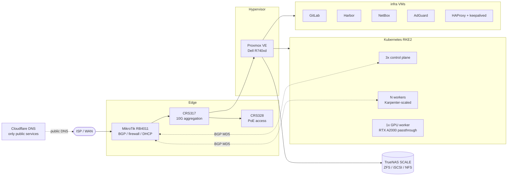
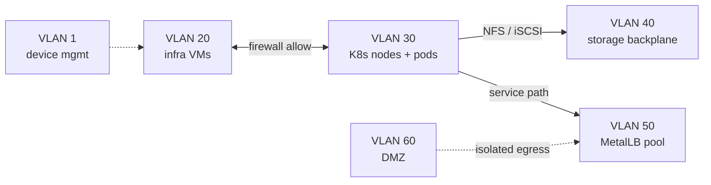
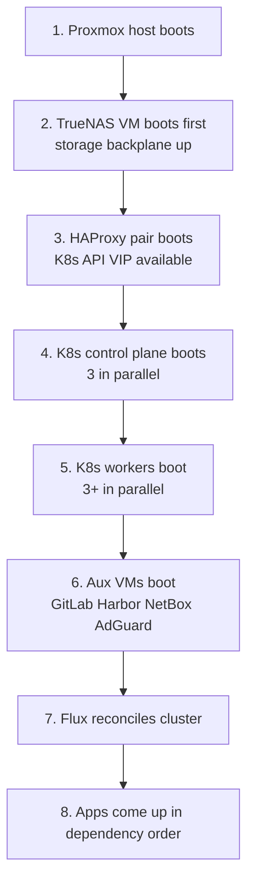
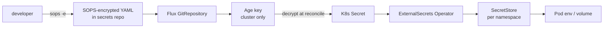
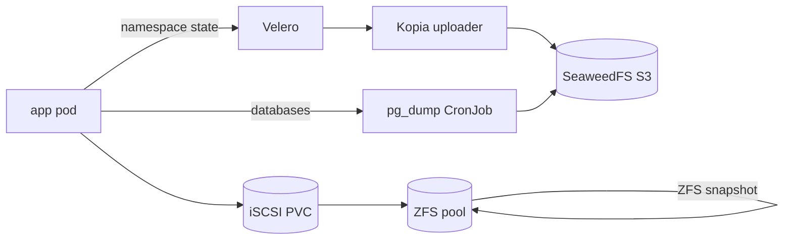

# Network topology

```mermaid
flowchart LR
    ISP([ISP / WAN])
    CF[Cloudflare DNS<br/>only public services]

    subgraph Edge
        RB[MikroTik RB4011<br/>BGP / firewall / DHCP]
        CRS17[CRS317<br/>10G aggregation]
        CRS28[CRS328<br/>PoE access]
    end

    subgraph Hypervisor
        PVE[Proxmox VE<br/>Dell R740xd]
    end

    subgraph K8s [Kubernetes RKE2]
        direction TB
        CTRL[3x control plane]
        WRK[N workers<br/>Karpenter-scaled]
        GPU[1x GPU worker<br/>RTX A2000 passthrough]
    end

    subgraph Infra [infra VMs]
        GL[GitLab]
        HBR[Harbor]
        NB[NetBox]
        AG[AdGuard]
        HA[HAProxy + keepalived]
    end

    NAS[(TrueNAS SCALE<br/>ZFS / iSCSI / NFS)]

    ISP --> RB
    CF -.public DNS.-> ISP
    RB --> CRS17
    CRS17 --> CRS28
    CRS17 --> PVE
    PVE --> K8s
    PVE --> Infra
    PVE --> NAS
    RB <-.BGP MD5.-> WRK
    RB <-.BGP MD5.-> CTRL
```

## VLAN map

```mermaid
flowchart LR
    V1[VLAN 1<br/>device mgmt]
    V20[VLAN 20<br/>infra VMs]
    V30[VLAN 30<br/>K8s nodes + pods]
    V40[VLAN 40<br/>storage backplane]
    V50[VLAN 50<br/>MetalLB pool]
    V60[VLAN 60<br/>DMZ]
    V1 -.-> V20
    V20 <-->|firewall allow| V30
    V30 -->|NFS / iSCSI| V40
    V30 -->|service path| V50
    V60 -.->|isolated egress| V50
```

## Bring-up order

```mermaid
flowchart TB
    A[1. Proxmox host boots]
    B[2. TrueNAS VM boots first<br/>storage backplane up]
    C[3. HAProxy pair boots<br/>K8s API VIP available]
    D[4. K8s control plane boots<br/>3 in parallel]
    E[5. K8s workers boot<br/>3+ in parallel]
    F[6. Aux VMs boot<br/>GitLab Harbor NetBox AdGuard]
    G[7. Flux reconciles cluster]
    H[8. Apps come up in dependency order]
    A --> B --> C --> D --> E --> F --> G --> H
```

## Secret flow

```mermaid
flowchart LR
    DEV[developer]
    SOPS[SOPS-encrypted YAML<br/>in secrets repo]
    AGE[Age key<br/>cluster only]
    GIT[Flux GitRepository]
    ESO[ExternalSecrets Operator]
    SS[SecretStore<br/>per namespace]
    SEC[K8s Secret]
    POD[Pod env / volume]

    DEV -->|sops -e| SOPS
    SOPS --> GIT
    GIT --> AGE
    AGE -->|decrypt at reconcile| SEC
    SEC --> ESO
    ESO --> SS
    SS --> POD
```

## Backup tiers

```mermaid
flowchart LR
    APP[app pod]
    PVC[(iSCSI PVC)]
    NAS[(ZFS pool)]
    VEL[Velero]
    KOP[Kopia uploader]
    SW[(SeaweedFS S3)]
    PG[pg_dump CronJob]

    APP --> PVC
    PVC --> NAS
    APP -->|namespace state| VEL
    VEL --> KOP --> SW
    APP -->|databases| PG --> SW
    NAS -->|ZFS snapshot| NAS
```
