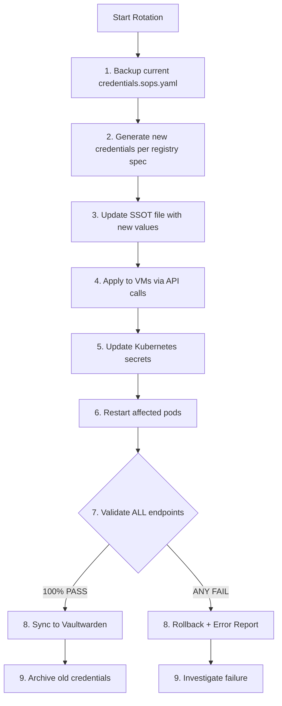

# Credential Rotation Runbook

## Overview

All infrastructure credentials are managed through a unified system with three components:

1. **SSOT File**: `secrets/credentials.sops.yaml`, SOPS-encrypted source of truth
2. **Credential Registry**: `secrets/credential-registry.yaml`, service definitions
3. **Rotation Playbook**: `homelab-ansible/playbooks/99-rotate-credentials.yml`, automation

Credentials are rotated via Ansible, never manually. The rotation playbook validates 100%
of endpoints before syncing new credentials to Vaultwarden.

## Rotation Flow



## Prerequisites

- SOPS Age key available at `~/.config/sops/age/keys.txt`
- Access to `homelab-ansible/` repository
- Access to `secrets/` repository

## Common Operations

### Rotate All Credentials

```bash
cd homelab-ansible
ansible-playbook playbooks/99-rotate-credentials.yml -e mode=all
```

### Rotate Specific Category

```bash
# Rotate only Kubernetes app credentials
cd homelab-ansible
ansible-playbook playbooks/99-rotate-credentials.yml \
  -e "mode=rotate categories=kubernetes"

# Available categories: kubernetes, infrastructure, network
```

### Generate New Credentials (No Rotation)

Used when adding a new service for the first time:

```bash
cd homelab-ansible
ansible-playbook playbooks/99-rotate-credentials.yml -e mode=generate
```

### Check Credential Status

```bash
cd homelab-ansible
ansible-playbook playbooks/99-rotate-credentials.yml -e mode=status
```

### View Current Credentials (Decrypted)

```bash
# View all credentials
sops -d secrets/credentials.sops.yaml | yq

# View specific service
sops -d secrets/credentials.sops.yaml | yq '.kubernetes.my-app'
```

## Adding a New Service

### 1. Add to Credential Registry

Edit `secrets/credential-registry.yaml`:

```yaml
kubernetes:
  my-new-app:
    enabled: true
    namespace: my-namespace
    credentials:
      - name: admin_password
        type: password
        length: 24
        special_chars: true
        rotation_days: 90
      - name: api_key
        type: api_key
        length: 32
        rotation_days: 180
    k8s_secret: my-app-credentials
    validation:
      type: http
      url: "https://my-app.example.com/health"
    vaultwarden:
      folder: Kubernetes Apps
      item_name: "My App - {credential_name}"
```

### 2. Generate Initial Credentials

```bash
cd homelab-ansible
ansible-playbook playbooks/99-rotate-credentials.yml -e mode=generate
```

Credentials will be:

- Generated per the spec (length, complexity, type)
- Stored encrypted in `secrets/credentials.sops.yaml`
- Applied to the Kubernetes secret `my-app-credentials` in `my-namespace`
- Validated via the health endpoint
- Synced to Vaultwarden on successful validation

## Credential Types

| Type | Description | Example Use |
|------|-------------|-------------|
| `password` | Alphanumeric + special chars | App admin passwords |
| `api_key` | Hex or alphanumeric | Service API keys |
| `api_token` | UUID or custom | GitLab tokens |
| `secret_key` | Hex or base64 | Django SECRET_KEY |
| `client_secret` | OIDC client secrets | Authentik OIDC |
| `reference` | Reference another credential | Shared credentials |

## Validation Types

| Type | When to Use | Example |
|------|-------------|---------|
| `api` | REST API endpoint | Proxmox, TrueNAS, GitLab |
| `http` | Simple HTTP health check | Jellyfin, Semaphore |
| `k8s_pod` | Check pod running | Authentik |
| `database` | PostgreSQL/Redis connection | DB services |

## Vaultwarden Sync

After successful rotation, credentials are synced to Vaultwarden automatically.
To manually trigger a sync:

```bash
kubectl create job \
  --from=job/credential-sync \
  credential-sync-manual \
  -n vaultwarden
```

Monitor the sync job:

```bash
kubectl logs -n vaultwarden job/credential-sync-manual -f
```

## Troubleshooting

### Rotation Failed: Validation Error

If validation fails for one or more services, the playbook rolls back automatically.

1. Check the error output for which service failed
2. Verify the service is healthy and reachable
3. Check the validation URL in `credential-registry.yaml`
4. Re-run the rotation after fixing the underlying issue

### SOPS Decryption Failed

```bash
# Verify age key is available
ls ~/.config/sops/age/keys.txt

# Test decryption manually
sops -d secrets/credentials.sops.yaml > /dev/null && echo "OK"

# Check SOPS configuration
cat secrets/.sops.yaml
```

### Kubernetes Secret Not Updated

```bash
# Check if secret exists
kubectl get secret my-app-credentials -n my-namespace

# Verify secret contents (base64 decoded)
kubectl get secret my-app-credentials -n my-namespace \
  -o jsonpath='{.data.admin_password}' | base64 -d

# Manually apply the secret if needed
kubectl apply -f secrets/kubernetes/my-namespace/my-app-credentials.yaml
```

### Vaultwarden Sync Failed

```bash
# Check sync job logs
kubectl logs -n vaultwarden \
  -l job-name=credential-sync \
  --tail=100

# Check if Vaultwarden automation user is working
curl -s https://vault.example.com/api/alive

# Manually trigger sync
kubectl create job \
  --from=job/credential-sync \
  credential-sync-retry \
  -n vaultwarden
```

## Related Files

| File | Purpose |
|------|---------|
| `secrets/credentials.sops.yaml` | SOPS-encrypted credential SSOT |
| `secrets/credential-registry.yaml` | Service definitions for auto-discovery |
| `homelab-ansible/playbooks/99-rotate-credentials.yml` | Rotation playbook |
| `homelab-kubernetes/apps/vaultwarden/base/jobs/credential-sync-job.yaml` | K8s sync job |
